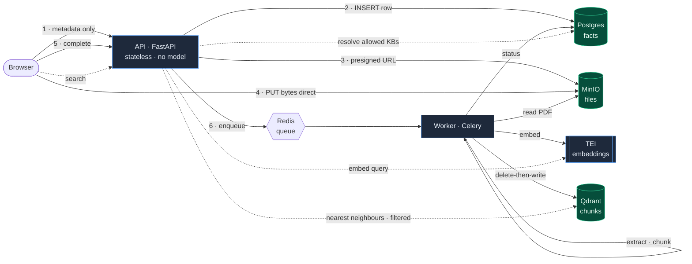

<div align="center">

# Sherpa

### Self-hosted semantic search over private PDFs

Ask a question in plain language, get back the most relevant **passages** — each with its
source file, page, snippet, and relevance score. No LLM, no hallucinations, and
**nothing ever leaves your infrastructure**.

<p>
  
  
  
  
  
  
  
</p>

</div>

---

## Why Sherpa

Most "chat with your docs" tools send your documents to a third-party API and answer with
a language model that can make things up. Sherpa does neither.

- **Fully private.** Embeddings run on your own hardware. No document content is ever sent to an external service.
- **Retrieval, not generation.** It returns the documents' *actual* passages — cheaper, faster, and free of hallucination risk. A "summarize the results" layer can be added later without touching the core.
- **Semantic, not keyword.** Matches on meaning, so a query finds the right passage even when the wording differs.
- **Scalable by default.** Decoupled services (API · embedding · workers · stores) that each scale independently — built for thousands of PDFs, not retrofitted.

> This repository is the complete, runnable **skeleton**: every service is wired, the full
> upload → ingest → search path works end-to-end, and it ships with a developer visualizer
> for seeing the flow.

## Table of contents

- [Features](#features)
- [Architecture](#architecture)
- [Tech stack](#tech-stack)
- [Quick start](#quick-start)
- [Developer flow visualizer](#developer-flow-visualizer)
- [API reference](#api-reference)
- [How it works](#how-it-works)
- [Data model](#data-model)
- [Project structure](#project-structure)
- [Configuration](#configuration)
- [Testing & verification](#testing--verification)
- [Design decisions](#design-decisions)
- [License](#license)

## Features

| | |
|---|---|
| **Semantic search** | Nearest-neighbour passage retrieval with relevance scores and caller-controlled `top_k`. |
| **Knowledge bases + access control** | Per-KB (or per-document) permissions resolved in SQL; Qdrant only ever sees the allowed filter. |
| **Direct-to-storage uploads** | Browser uploads straight to MinIO via presigned URLs — file bytes never pass through the API. |
| **OCR fallback** | Scanned / image-only pages are detected and run through Tesseract automatically. |
| **Idempotent ingestion** | Deterministic point IDs + delete-then-write mean retries and re-ingests converge to exactly the right state. |
| **Robust failures** | Bounded retries, a dead-letter queue for poison files, and per-document status in Postgres. |
| **Self-healing uploads** | A periodic sweep recovers uploads that were stored but never confirmed. |
| **Flow visualizer** | A built-in dev tool that animates real backend I/O across the architecture. |

## Architecture

Three data stores, each authoritative for one thing: **MinIO** holds the *files*,
**Postgres** holds the *facts* about them (status, ownership, permissions), and **Qdrant**
holds the searchable *chunks* (derived, rebuildable from MinIO).



Both the API (one query vector) and the workers (bulk chunk vectors) call the **same**
embedding service, so "query and ingestion must use the same model" is a structural
guarantee — there is only one model, in one place.

### Services

| Service | Role |
| --- | --- |
| `api` | FastAPI, stateless, **no model**. Runs migrations + Qdrant bootstrap on startup. |
| `worker` | Celery: parse → chunk → embed → write. Scale with `--scale worker=N`. |
| `beat` | Celery beat: the abandoned-upload sweep. |
| `tei` | Text Embeddings Inference serving `BAAI/bge-small-en-v1.5` (384-dim). |
| `qdrant` | Vector store — single `chunks` collection, payload indexes on `doc_id` / `kb_id`. |
| `postgres` | System of record (documents, KBs, users/groups, permissions). |
| `redis` | Celery broker + result backend. |
| `minio` | S3-compatible object storage for raw PDF bytes (+ `minio-init` creates the bucket). |

## Tech stack

**Python 3.12** · **FastAPI** + Uvicorn · **Celery** + Redis · **SQLAlchemy 2.0** + Alembic ·
**Qdrant** · **MinIO** (boto3) · **PyMuPDF** + Tesseract OCR · **tiktoken** ·
Hugging Face **TEI** · all orchestrated with **Docker Compose**.

## Quick start

```bash
cp .env.example .env          # defaults already match the compose service names
docker compose up --build     # first boot downloads the embedding model — give it a minute
```

Then:

- **Visualizer:** <http://localhost:8000/> &nbsp;·&nbsp; **API docs:** <http://localhost:8000/docs>
- **MinIO console:** <http://localhost:9001> (`minioadmin` / `minioadmin`)

> [!NOTE]
> **Apple Silicon (arm64).** The official TEI CPU image is amd64-only and is flaky under
> emulation. `docker-compose.override.yml` (auto-loaded) swaps the `tei` service for a small
> arm64-native sidecar (`embed_server/`, fastembed) serving the **same model** behind the
> **same `/embed` contract**. For production / amd64, run real TEI explicitly:
> `docker compose -f docker-compose.yml up`.

## Developer flow visualizer

A built-in tool — **not** the user-facing app — that animates how the backend actually
works. Click a button and watch each hop light up across the diagram while a timeline logs
the real data and per-step latency. Every action performs genuine backend I/O: real
Postgres rows, real MinIO objects, real TEI embeddings, real Qdrant points.

Open <http://localhost:8000/> and try **Ingest a document**, then **Search as Alice**
(returns hits) vs **Search as Bob** (no access → the query short-circuits before Qdrant).
Backed by `/demo/*` in [`api/routes/demo.py`](src/sherpa/api/routes/demo.py).

## API reference

| Method | Endpoint | Description |
| --- | --- | --- |
| `POST` | `/documents` | Register a document, get a presigned upload URL. |
| `POST` | `/documents/{id}/complete` | Confirm the upload, enqueue ingestion. |
| `GET` | `/documents/{id}` | Document status (the source of truth for "is it searchable?"). |
| `POST` | `/search` | Semantic search → ranked `{doc_id, filename, page, snippet, score}`. |
| `GET` | `/healthz` | Liveness probe. |
| `GET` | `/docs` | Interactive OpenAPI docs. |
| `*` | `/demo/*` | Visualizer backend (state · ingest · search · reset). |

> Authentication in this skeleton is a dev `X-User-Id` header. Real auth (sessions / JWT)
> swaps a single function — [`api/deps.py:current_user`](src/sherpa/api/deps.py).

## How it works

**Ingestion** (offline, per document, runs in a worker):

1. Read the PDF from MinIO.
2. Extract text with PyMuPDF; OCR any page with no text layer via Tesseract.
3. Split into overlapping ~450-token chunks, keeping the source page on each.
4. Embed every chunk through TEI.
5. **Delete-by-`doc_id`, then upsert** points with deterministic IDs → idempotent.
6. Drive Postgres status `queued → processing → done` (or `failed` → dead-letter).

**Query** (per request, stateless):

1. Resolve which knowledge bases the user may see (Postgres).
2. Embed the question with the **same** model used at ingestion.
3. Ask Qdrant for nearest neighbours **where `kb_id ∈ allowed`**.
4. Return the ranked passages with scores.

## Data model

```
documents ──< document_kb >── knowledge_bases
   │                                  │
 status, page_count,            kb_access ──> users / groups
 object_key, error
```

- **`documents`** — one row per PDF: `doc_id`, `object_key`, `status`, `page_count`, timestamps.
- **`knowledge_bases`** + **`document_kb`** — many-to-many membership (`kb_id` is a list by design).
- **`users` / `groups` / `user_groups`** + **`kb_access`** — the permission source of truth.

Every Qdrant point carries `{ doc_id, kb_id[], filename, page, snippet }`, with payload
indexes on the two filtered fields (`doc_id`, `kb_id`).

## Project structure

```
sherpa/
├── docker-compose.yml            # 7 services + minio-init
├── docker-compose.override.yml   # arm64-native embedding sidecar (dev)
├── docker/                       # api + worker Dockerfiles
├── migrations/                   # Alembic (0001_init)
├── embed_server/                 # local TEI-compatible sidecar (fastembed)
├── scripts/                      # bootstrap_qdrant · seed · smoke_test
└── src/sherpa/
    ├── config.py                 # all settings (pydantic-settings)
    ├── schemas.py                # request/response models
    ├── db/                       # SQLAlchemy models + session
    ├── clients/                  # tei · qdrant · storage (MinIO)
    ├── ingestion/                # extract (+OCR) · chunk · pipeline
    ├── worker/                   # celery app + tasks (ingest, sweep, dead-letter)
    └── api/                      # FastAPI app, routes, static visualizer
```

## Configuration

All settings live in [`src/sherpa/config.py`](src/sherpa/config.py) and are overridable via
`.env`. The ones that matter most:

| Variable | Purpose |
| --- | --- |
| `EMBED_DIM` | Must equal the TEI model's output dimension (384 for bge-small). |
| `CHUNK_TOKENS` / `CHUNK_OVERLAP_TOKENS` | The main retrieval-quality knob. |
| `MAX_INGEST_RETRIES` | Transient-failure retry cap before dead-letter. |
| `MINIO_PUBLIC_ENDPOINT` | Host-reachable endpoint baked into presigned upload URLs. |
| `ABANDONED_AFTER_S` / `SWEEP_INTERVAL_S` | Abandoned-upload sweep timing. |

## Testing & verification

**Offline smoke test** (no services needed):

```bash
python -m venv .venv && .venv/bin/pip install -e .
.venv/bin/python scripts/smoke_test.py
```

**End-to-end** (stack up):

```bash
# Seed a KB + users (alice has access, bob does not)
docker compose exec api python scripts/seed.py

# Health check
curl -s localhost:8000/healthz
```

Then drive the upload → ingest → search flow from the [visualizer](#developer-flow-visualizer),
or via `curl` against the [API](#api-reference). Worth confirming:

- **Idempotency** — re-ingest a doc; the Qdrant point count is unchanged.
- **Failure path** — upload a non-PDF; it lands in `status=failed` + on the `dead_letter` queue.
- **OCR** — a scanned, image-only PDF still produces chunks.
- **Access control** — Bob (no `kb_access`) gets zero hits; Qdrant is never queried.
- **Persistence** — `docker compose restart qdrant postgres`; data survives.

## Design decisions

Deliberate, single-seam simplifications — none require reworking the payload or pipeline to lift later:

- **Auth** is a dev header today; real auth replaces one function.
- **Ingest trigger** is browser-confirmation + the sweep; MinIO bucket notifications are the event-driven upgrade.
- **Scale levers** (GPU on TEI, more workers, API replicas, Qdrant sharding) are independent of the data model.
- **No generation step.** `/search` is clean structured JSON — the correct retrieval backend for a future agent or "summarize results" feature, kept on your own infrastructure.

## License

Released under the [MIT License](LICENSE).
